# 一、项目基本介绍

### 1 前后端分离

本项目是前后端分离的，其中：

- `front_end_pc`是使用Vue编写的前端文件，估计有些小bug，但是不影响项目，如果可以，您可以自己编写后端逻辑代码，继续丰富整个项目
- `tuling_mall`是使用Django2.2.6编写的后端文件
- 在Ubuntu子系统运行的项目

本人只跟着老师的教学流程编写了后端文件`tuling_mall`

### 2 项目结构

##### 2.1 其他资料

```shell
datas              # 存储其他资料的文件
  |—— app_private_key.pem  # 图灵商城私钥
  |—— app_public_key.pem   # 图灵商城公钥
  |—— areas.sql           # 我国区域sql文件，全国范围的省市县区，areas子应用需要用到
  |—— goods_data.sql      # 商品与广告内容的sql文件，goods子应用和contents子应用需要用到
  |—— requirements.txt    # 本项目用到的模块
```

图灵商城公私钥文件是本人在Ubuntu子系统上生成的，当然您也可以自己生成图灵商城的公私钥文件

##### 2.2 前端文件

```shell
front_end_pc       # 前端文件
```

##### 2.3 后端文件

```shell
tuling_mall        # 后端文件
  |—— apps           # 子应用
    |—— areas          # 地域/地区子应用
    |—— carts          # 购物车子应用
    |—— contents       # 广告子应用
    |—— goods          # 商品子应用
    |—— orders         # 订单子应用
    |—— pay            # 支付子应用
    |—— users          # 用户子应用
    |—— vertifications # 验证子应用
  |—— celery_tasks   # celery异步任务
    |—— email          # 激活邮件发送任务
    |—— sms            # 短信验证码发送任务
    |—— config.py      # 消息队列配置
    |—— main.py        # celery配置
  |—— libs           # 存放第三方库
    |—— captcha        # 图形验证码工具包
    |—— yuntongxun     # 云通讯第三方短信发送平台
  |—— logs           # 日志文件
  |—— script         
    |—— detail.py      # 商品详情页面静态化脚本
  |—— templates      # 模板
    |—— search         # 全文检索索引
    |—— 404.html       # 404页面
    |—— detail.html    # 商品详情页模板
    |—— index.html     # 商品首页模板
  |—— tuling_mall
    |—— settings.py    # 项目配置文件
    |—— urls.py        # 工程路由/总路由
    |—— wsgi.py
  |—— utils          # 自定义的公共工具类
    |—— FastDFS        # FastDFS
    |—— converters.py  # 自定义路由转换器
    |—— goods.py       # 商品分类、面包屑导航、商品规格
    |—— models.py      # 模型类基类
    |—— views.py       # 检验用户是否登录
  |—— db.sqlite3
  |—— manage.py
  |—— uwsgi.ini      # uwsgi配置文件
  |—— uwsgi.log      # uwsgi日志文件
  |—— uwsgi.pid
```

# 二、使用说明

### 1 容联云通讯

本项目的注册页面中需要短信验证码，所以接入了第三方发送短信的平台[容联云](https://www.yuntongxun.com/)，有免费使用额度，便于个人学习与测试使用

##### 1.1 开发者主账号

为了项目的顺利使用，您需要注册该平台，登录后，请特别关注【主账号ID】、【账户授权令牌】、【APPID】这三个内容

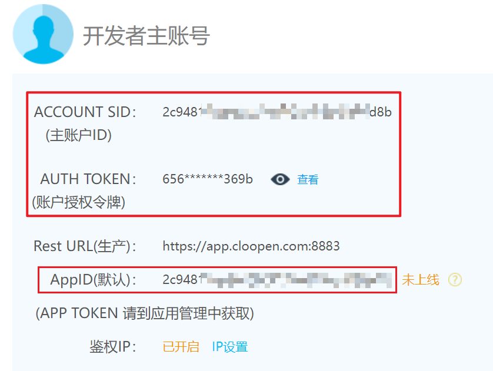

##### 1.2 测试号码

填写自己的手机号码，可以用来接收平台发送的验证码

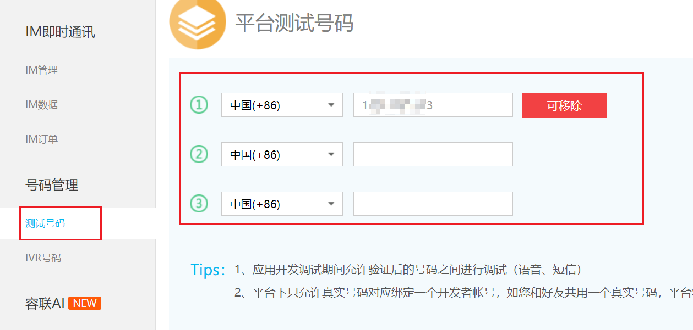

##### 1.3 修改yuntongxun工具包

只需要修改`libs/yuntongxun/sms.py`文件中的三个地方: `_accountSid`、`_accountToken`、`_appId`，将开发者主账号中的【主账号ID】、【账户授权令牌】、【APPID】分别填入

注意：其他地方无需修改

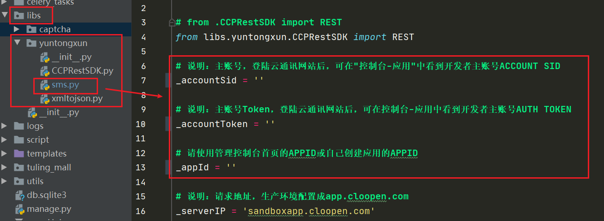

### 2 数据库

> 本项目使用了MySQL数据库与Redis数据库，不使用Django自带的SQLite，因为性能太差

##### 2.1 MySQL

将很多数据存储在MySQL的`tuling_mall`数据库，因此，在迁移模型类之前，需要建立`tuling_mall`数据库

本人是在Ubuntu子系统运行的，所以需要修改数据库运行的IP，例如`HOST`需要更改为您本人的IP

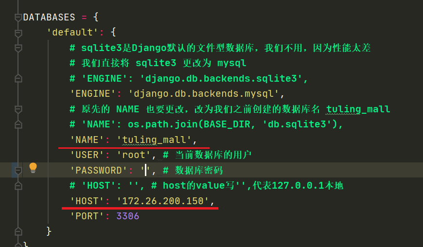

##### 2.2 Redis

本人是在Ubuntu子系统运行的，Redis的`LOCATION`也需要更改为您本人的IP

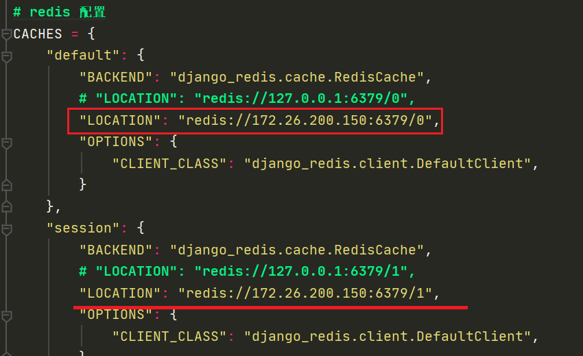

### 3 邮件发送

##### 3.1 修改邮箱配置

为了成功发送激活邮箱，请在`settings.py`的邮箱配置中填写自己的邮箱与授权码

本项目，使用的是QQ邮箱，因此`EMAIL_HOST`是`smtp.qq.com`

如果使用其他邮箱作为发送方，就需要更改

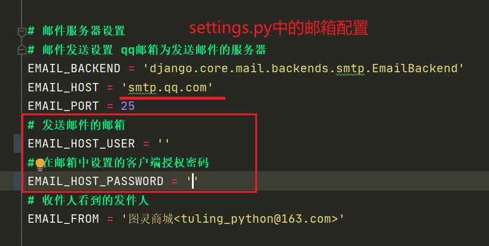

##### 3.2 修改邮箱视图

位置：`apps/users/views.py`的`EmailView`视图类

请填写发件人邮箱和收件人邮箱

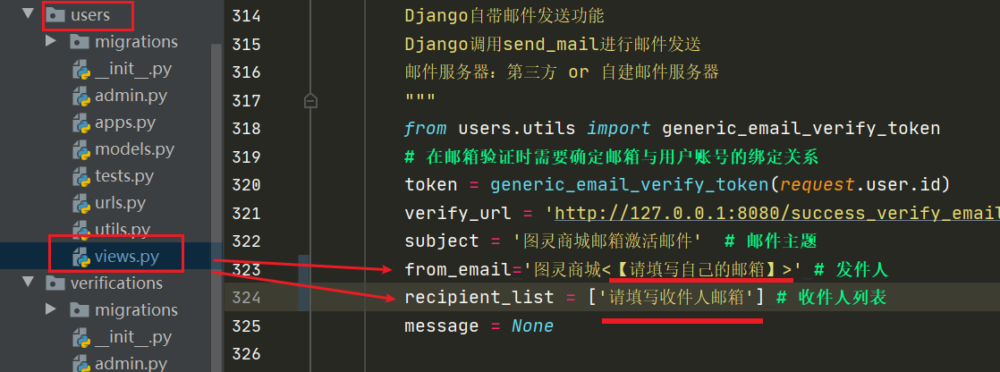

##### 3.3 同步与异步发邮件

在该`EmailView`视图类中也编写了异步发送邮件的方法

如果想使用异步celery发送邮件，就把注释放开，将同步发送邮件的代码注释掉

最后使用命令启动celery

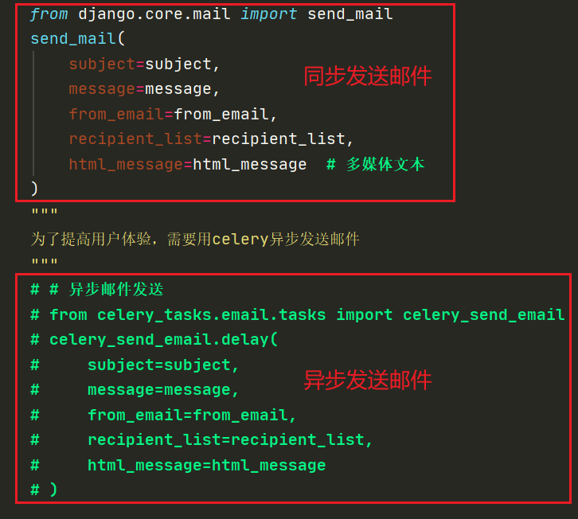

### 4 支付宝支付

在订单支付功能中，设计了支付宝网页支付功能

子应用`pay`就是实现支付宝网页支付功能的应用

注意：本项目使用的是**支付宝的沙箱环境**，供测试使用

支付宝开放平台：https://open.alipay.com/

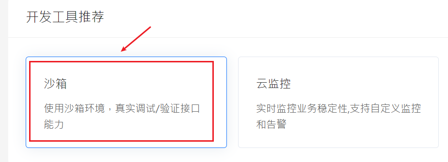

##### 4.1 支付宝开发文档

- 文档主页： https://openhome.alipay.com/developmentDocument.htm

- 电脑网站支付产品介绍： https://docs.open.alipay.com/270

- 电脑网站支付快速接入： https://docs.open.alipay.com/270/105899/

- API列表： https://opendocs.alipay.com/open/cd12c885_alipay.trade.app.pay?scene=20&pathHash=c0e35284

- SDK文档： https://docs.open.alipay.com/270/106291/

- ❤ Python支付宝SDK： 【非官方支付宝，比官方的更好用】

  https://github.com/fzlee/alipay/blob/master/README.zh-hans.md

  - SDK安装： `pip install python-alipay-sdk --upgrade`

##### 4.2 配置支付宝公钥

在沙箱环境中配置支付宝公钥，将**图灵商城公钥`app_publick_key.pem`**上传，就可以得到**支付宝公钥**

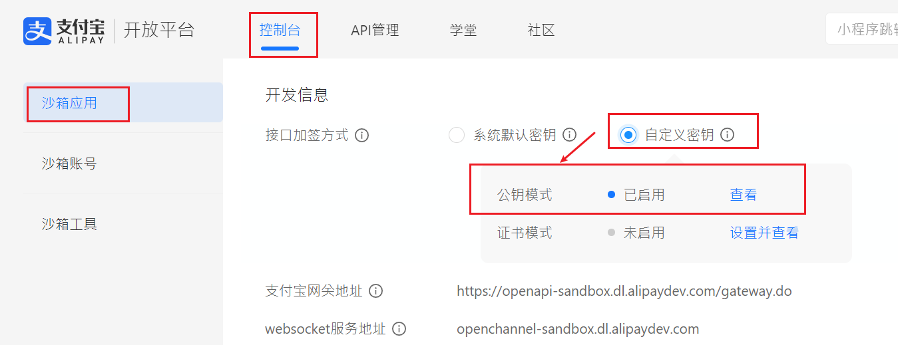

- 复制支付宝公钥内容，新建一个名为`alipay_public_key.pem`的文件

- `alipay_public_key.pem`文件格式

  ```markdown
  -----BEGIN PUBLIC KEY-----
       支付宝公钥内容
  -----END PUBLIC KEY-----
  ```

**注意：支付宝公钥与图灵商城私钥存放位置**

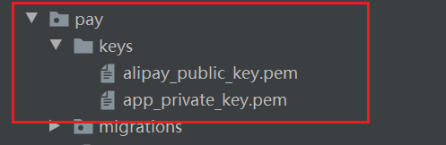

##### 4.3 修改支付配置

在`settings.py`配置文件修改支付配置

需要修改两个地方：

- `ALIPAY_APPID`：请填写自己的沙箱环境中的APPID

  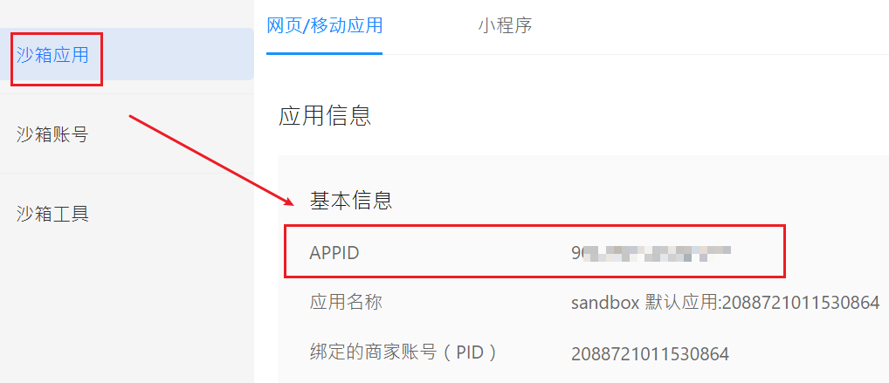

- `ALIPAY_RETURN_URL`：因为本人是在Ubuntu子系统中运行的项目，所以网址的IP得更改成自己系统的IP

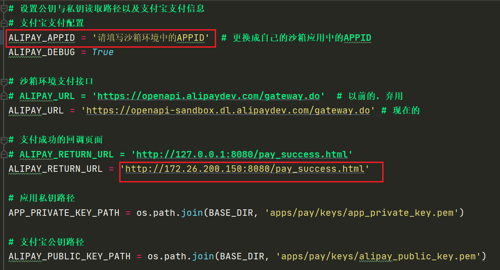

##### 4.4 沙箱账号可用来支付测试

沙箱账号的买家账号可以用来进行支付测试~

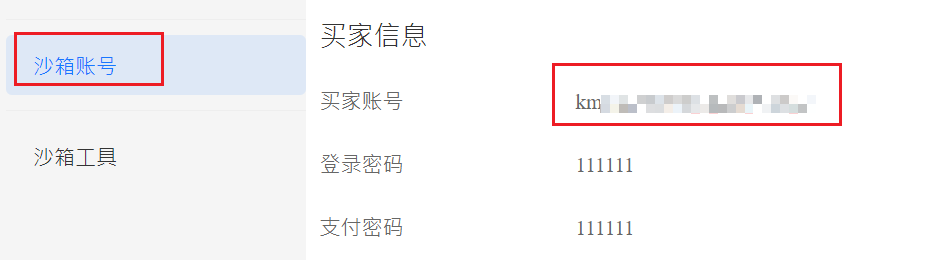

### 5 跨域白名单设置

本人的项目是在Ubuntu子系统上运行的，所以在`settings.py`配置文件中的跨域白名单`CORS_ORIGIN_WHITELIST`中添加了本人Ubuntu子系统的IP

如果您不是在本地运行项目，而是在虚拟机上运行，同样需要添加跨域白名单

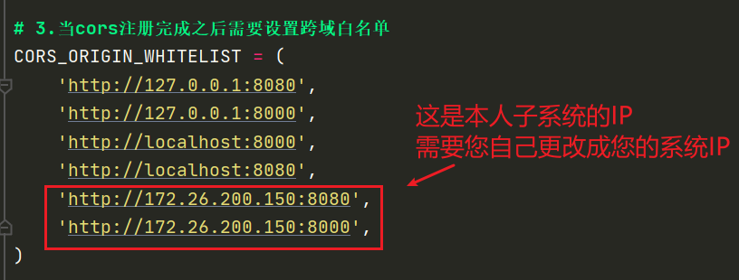

### 6 uwsgi配置文件

本项目使用了uwsgi进行了简单的部署，如果您想使用uwsgi进行部署，需要改动以下几个地方：

```shell
# 1. 将IP修改为您项目所在系统的IP
http=172.26.200.150:8000

# 2. 修改项目目录
chdir=/home/paofufu/Desktop/NewProject/tuling_mall

# 3. 指定依赖的虚拟环境:
# which python 命令 可以查询虚拟环境的路径 
# 注意：不需要加bin/python
virtualenv=/home/paofufu/miniconda3/  # 本人使用的是miniconda
```

### 7 迁移模型

```shell
python manage.py makemigrations
python manage.py migrate
```


# 三、项目启动

### 1 启动前端

进入前端文件夹的根目录

```shell
$ cd front_end_pc  # cd到前端文件夹的根路径
$ python -m http.server 8080
```

### 2 启动后端

```shell
# cd到Django项目的根路径
$ cd tuling_mall 

# 启动uwsgi
$ uwsgi --ini uwsgi.ini  
```

- 其他命令

```shell
# 重启
$ uwsgi --reload uwsgi.ini

# 关闭
$ uwsgi --stop uwsgi.pid
```

- 用杀死进程的方式关闭`uwsgi`

```shell
# 第一步先查询进程号PID
ps -ef | grep uwsgi

# 第二步关闭进程
# kill -9 命令会发送一个强制终止的信号给进程，无论进程的状态如何，都会立即终止进程
kill -9 uwsgi_pid

# 例如，假设uwsgi进程的PID是10165，你可以运行以下命令来强制终止进程：
kill -9 10165
```

### 3 访问项目

当前后端都启动后，可以通过浏览器来访问`http://您服务器的IP:8080/`进入项目编写的网站了


# 四、声明

建议使用Ubuntu来运行本项目，因为有些功能Windows使用不了

本项目是本人跟随老师的教学流程与视频进行编写的，本人只编写了后端，前端文件虽有些小bug，但是不影响使用，如果您在使用本项目的途中发现了有些功能本人未写到，您可以尝试丰富完善它。

如有侵权，请联系本人(QQ：1442827668)。

若您使用本项目侵害他人利益，那么与本人无关，本项目只供学习与交流。
